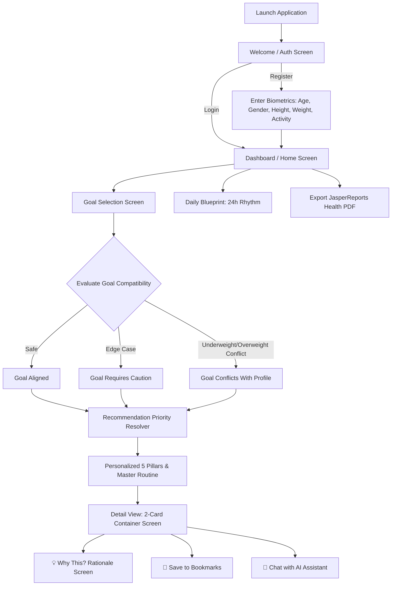

# 🌟 LIFEForge - Rule-Based Health & Lifestyle Recommendation Engine

[](https://www.oracle.com/java/)
[](https://gradle.org/)
[](https://www.postgresql.org/)
[](https://github.com/WilliamAGH/tui4j)
[](https://community.jaspersoft.com/)
[](https://junit.org/junit5/)

**LIFEForge** is a terminal-driven, evidence-based lifestyle and wellness platform built with Java 21. It combines physiological modeling, a deterministic **Rule-Based Recommendation Engine**, and interactive **Terminal UI (TUI)** ergonomics to generate deeply personalized guidance across nutrition, exercise, hydration, sleep, and micro-habits.

---

## 📑 Table of Contents
1. [Core Features](#-core-features)
2. [Project Architecture](#-project-architecture)
3. [User Journey & Workflow](#-user-journey--workflow)
4. [Project Structure](#-project-structure)
5. [Database Schema](#-database-schema)
6. [Prerequisites & Installation](#-prerequisites--installation)
7. [Running & Testing](#-running--testing)
8. [Git Commit Guide](#-git-commit-guide)

---

## 🚀 Core Features

### 1. Rule-Based Personalized Recommendation Engine
* **Multivariate Personalization**: Generates targeted guidance calibrated from user biometrics:
  $$\text{Profile} = f(\text{Age}, \text{Gender}, \text{Height}, \text{Weight}, \text{Activity Level}, \text{Goal})$$
* **Age-Adaptive Logic Across All Categories**:
  * **🍽️ Nutrition**: Meal protein distribution (~25–30g for young adults vs. 35–40g+ for mature adults to overcome anabolic resistance), workout carbohydrate timing, and bone/joint micronutrients.
  * **🏋️ Exercise**: Rep ranges, progressive overload compound training vs. controlled joint-sparing eccentrics, dedicated dynamic mobility prep, and session frequency.
  * **💧 Hydration**: Pre-workout fluid compensation vs. proactive clock-based hydration for declining thirst cues and spinal disc/joint cushioning.
  * **🌙 Sleep & Recovery**: Age-adapted neuromuscular recovery windows (48h vs. 48–72h), light-dimming routines, and pre-bed fluid tapering.
  * **🌱 Micro-Habits**: Low-friction cues (post-meal walks, workout gear staging, morning mobility, spinal decompression).
* **Master Routine & Daily Blueprint**: A unified 5-pillar master routine with chronological morning, midday, evening, and night lifestyle guidance.

### 2. Biometric Calculations & Goal Compatibility Status
* **Mifflin-St Jeor BMR & TDEE**: Accurate basal metabolic rate and daily expenditure based on physical activity multipliers.
* **Intelligent Goal Compatibility**: Real-time evaluation preventing physiological conflict (e.g., underweight users selecting aggressive weight loss):
  * `✓ GOAL ALIGNED`
  * `⚠ GOAL REQUIRES CAUTION`
  * `! GOAL MAY CONFLICT WITH PROFILE`

### 3. Rich Terminal User Interface (TUI)
* Built on **TUI4J** and **JLine 3.27** with full Windows Terminal / Linux ANSI styling.
* Word-wrapped nested card containers, border alignment guarantees, horizontal menu bars, and intuitive keyboard navigation.

### 4. AI Explanation & Contextual Chat
* Context-aware physiological explanations detailing *Why This Recommendation Fits You*.
* Multi-turn AI chat providing evidence-based answers to user fitness and health questions.

### 5. Enterprise Features & JasperReports Export
* **Executive PDF Reports**: Generates health summaries and bookmarked recommendations via **JasperReports 6.21**.
* **Role-Based Security**: BCrypt password hashing, admin user management, recommendation CMS, and system-wide audit logging.

---

## 🏛️ Project Architecture

LIFEForge follows a clean **Layered MVC Architecture** with strong separation of concerns:

```
+-------------------------------------------------------------+
|                     PRESENTATION LAYER                      |
|      com.lifeforge.view (LifeForge, ScreenKit, Theme)       |
|               Terminal UI powered by TUI4J & JLine          |
+------------------------------+------------------------------+
                               |
+------------------------------v------------------------------+
|                      CONTROLLER LAYER                       |
|   com.lifeforge.controller (Auth, Goal, Recommendation,     |
|              Report, SavedRecommendation, Admin)            |
+------------------------------+------------------------------+
                               |
+------------------------------v------------------------------+
|                       SERVICE LAYER                         |
|   com.lifeforge.service (RecommendationEngine, Priority,     |
|   CalorieService, HydrationService, AuthService, Reports)   |
+------------------------------+------------------------------+
                               |
+------------------------------v------------------------------+
|                  DATA ACCESS LAYER (DAO)                    |
|   com.lifeforge.dao (UserDao, GoalDao, RecommendationDao,    |
|               CategoryDao, SavedRecommendationDao)          |
+------------------------------+------------------------------+
                               |
+------------------------------v------------------------------+
|                    DATABASE & PERSISTENCE                   |
|                   PostgreSQL 14+ Relational DB              |
+-------------------------------------------------------------+
```

---

## 🔄 User Journey & Workflow



---

## 📁 Project Structure

```text
LifeForge/
├── build.gradle                               # Gradle dependencies & application JVM flags
├── gradlew / gradlew.bat                      # Gradle wrapper scripts
├── src/
│   ├── main/
│   │   ├── java/com/lifeforge/
│   │   │   ├── Main.java                      # Application entry point
│   │   │   ├── AppContext.java                # Dependency Injection container
│   │   │   ├── Session.java                   # In-memory user session state
│   │   │   ├── config/                        # App & Database configuration
│   │   │   │   ├── AppConfig.java
│   │   │   │   └── DatabaseConfig.java
│   │   │   ├── controller/                    # Presentation controllers
│   │   │   │   ├── AuthController.java
│   │   │   │   ├── GoalController.java
│   │   │   │   ├── RecommendationController.java
│   │   │   │   ├── ReportController.java
│   │   │   │   ├── SavedRecommendationController.java
│   │   │   │   └── AdminController.java
│   │   │   ├── dao/                           # JDBC Data Access Objects
│   │   │   │   ├── UserDao.java
│   │   │   │   ├── GoalDao.java
│   │   │   │   ├── RecommendationDao.java
│   │   │   │   └── AuditLogDao.java
│   │   │   ├── dto/                           # Data Transfer Objects
│   │   │   ├── model/                         # Domain Entities & Value Objects
│   │   │   │   ├── User.java
│   │   │   │   ├── Goal.java
│   │   │   │   ├── GoalCompatibilityStatus.java
│   │   │   │   ├── Recommendation.java
│   │   │   │   ├── DailyBlueprint.java
│   │   │   │   └── CalculationTrace.java
│   │   │   ├── service/                       # Business Logic & Recommendation Engine
│   │   │   │   ├── RecommendationEngine.java  # Core Rule-Based Engine
│   │   │   │   ├── RecommendationPriorityResolver.java
│   │   │   │   ├── CalorieService.java
│   │   │   │   ├── HydrationService.java
│   │   │   │   ├── JasperReportsService.java
│   │   │   │   └── AiExplanationService.java
│   │   │   ├── util/                          # Math, Formula & Validation utilities
│   │   │   │   ├── CalorieCalculator.java     # Mifflin-St Jeor implementation
│   │   │   │   ├── HydrationCalculator.java
│   │   │   │   └── ValidationUtil.java
│   │   │   └── view/                          # TUI4J Terminal UI Layer
│   │   │       ├── LifeForge.java             # Main TUI state machine & view renderers
│   │   │       ├── LifeForgeRunner.java       # Terminal bootstrapper
│   │   │       ├── ScreenKit.java             # Layout boxes, menus, footer components
│   │   │       └── Theme.java                 # ANSI color palettes & styles
│   │   └── resources/
│   │       ├── db/
│   │       │   ├── schema.sql                 # PostgreSQL DDL tables & indexes
│   │       │   └── seed.sql                   # Initial goals and recommendations seed data
│   │       └── reports/
│   │           ├── lifeForge_report.jrxml     # Comprehensive Health Report template
│   │           └── SavedRecommendationsReport.jrxml
│   └── test/java/com/lifeforge/               # Comprehensive JUnit 5 Test Suite
│       ├── engine/PersonalizedRecommendationEngineTest.java
│       ├── service/                           # Unit tests for services
│       └── view/                              # TUI layout & border alignment tests
```

---

## 🗄️ Database Schema

The relational database is built with PostgreSQL:

* `users`: Stores credentials (BCrypt hash), physical profile (height, weight, age, gender, activity level), and role (`USER`, `ADMIN`).
* `goals`: Predefined and custom goals (`BUILD_MUSCLE`, `LOSE_WEIGHT`, `MAINTAIN_WEIGHT`, `IMPROVE_FITNESS`, `INCREASE_ENDURANCE`, `BETTER_SLEEP`, `REDUCE_STRESS`, `GENERAL_WELLNESS`).
* `user_goals`: Tracks current and historical goal assignments per user.
* `recommendation_categories`: Hierarchical category tree (Nutrition, Exercise, Sleep & Recovery, Habits, Hydration).
* `recommendations`: CMS-managed recommendation blueprints with targets, actions, and instructions.
* `saved_recommendations`: User bookmarked recommendations.
* `audit_logs`: Administrator and user activity tracking.
* `password_resets`: Password reset verification tokens and expiration.

---

## ⚙️ Prerequisites & Installation

### Requirements
* **Java Development Kit (JDK)**: Version 21 or higher
* **PostgreSQL**: Version 14 or higher
* **Terminal**: Windows Terminal, Command Prompt, PowerShell, or macOS/Linux Terminal with UTF-8 support.

### Setup Database
1. Create database:
   ```sql
   CREATE DATABASE lifeforge;
   ```
2. Run schema and seed scripts:
   ```bash
   psql -U postgres -d lifeforge -f src/main/resources/db/schema.sql
   psql -U postgres -d lifeforge -f src/main/resources/db/seed.sql
   ```
3. Configure connection in `src/main/resources/application.properties` (or environment variables):
   ```properties
   db.url=jdbc:postgresql://localhost:5432/lifeforge
   db.user=postgres
   db.password=your_password
   ```

---

## 🧪 Running & Testing

### Run the Application
Launch the terminal application with full UTF-8 encoding support:
```powershell
.\gradlew.bat run
```
*(On macOS/Linux: `./gradlew run`)*

### Run Automated Tests
Execute the age personalization test suite:
```powershell
.\gradlew.bat test --tests "com.lifeforge.engine.PersonalizedRecommendationEngineTest.testAgePersonalizationAcrossAllCategoriesForBuildMuscle"
```

Execute all recommendation engine and view tests:
```powershell
.\gradlew.bat test --tests "com.lifeforge.engine.PersonalizedRecommendationEngineTest"
```

Execute the full project test suite:
```powershell
.\gradlew.bat test
```


